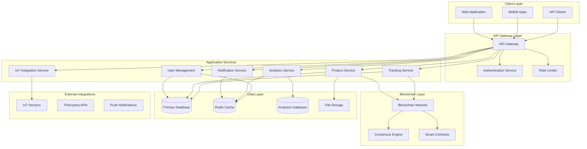

# MediLedger Enhancement Design Document

## Overview

This design document outlines the architectural improvements and technical implementation strategy for transforming MediLedger from a prototype into a production-ready enterprise pharmaceutical supply chain management system. The design addresses security, scalability, performance, testing, and advanced features while maintaining the core blockchain-based tracking functionality.

The enhanced system will support enterprise-scale operations with robust security measures, comprehensive testing frameworks, advanced analytics, mobile applications, IoT integration, and sophisticated API capabilities. The architecture follows microservices principles with clear separation of concerns and horizontal scalability.
## Arch
itecture

### High-Level Architecture

The enhanced MediLedger system follows a microservices architecture with the following core components:



### Technology Stack Evolution

#### Backend Services
- **Framework**: Flask → FastAPI (for better async support and automatic API documentation)
- **Database**: SQLite → PostgreSQL (primary) + MongoDB (analytics)
- **Cache**: Redis for session management and frequently accessed data
- **Message Queue**: RabbitMQ for asynchronous processing
- **Search Engine**: Elasticsearch for advanced search capabilities

#### Security Layer
- **Authentication**: JWT tokens with refresh token rotation
- **Authorization**: Role-based access control (RBAC) with fine-grained permissions
- **Encryption**: AES-256 for data at rest, TLS 1.3 for data in transit
- **API Security**: OAuth 2.0, API key management, rate limiting

#### Blockchain Enhancement
- **Consensus**: Proof of Authority (PoA) for enterprise networks
- **Smart Contracts**: Ethereum-compatible smart contracts for automated compliance
- **Scalability**: Layer-2 solutions for high-throughput operations
- **Interoperability**: Cross-chain bridges for integration with existing blockchain networks

#### Mobile Applications
- **Framework**: React Native for cross-platform development
- **Offline Support**: SQLite local storage with sync capabilities
- **Push Notifications**: Firebase Cloud Messaging (FCM)
- **Biometric Authentication**: TouchID/FaceID integration

#### IoT Integration
- **Protocol**: MQTT for lightweight sensor communication
- **Edge Computing**: Local processing for real-time alerts
- **Data Pipeline**: Apache Kafka for streaming sensor data
- **Device Management**: AWS IoT Core or Azure IoT Hub

## Components and Interfaces

### 1. Enhanced Security Framework

#### Multi-Factor Authentication (MFA)
```python
class MFAService:
    def generate_totp_secret(self, user_id: str) -> str
    def verify_totp_token(self, user_id: str, token: str) -> bool
    def send_sms_code(self, phone_number: str) -> str
    def verify_sms_code(self, phone_number: str, code: str) -> bool
    def enable_biometric_auth(self, user_id: str, biometric_data: dict) -> bool
```

#### Encryption Service
```python
class EncryptionService:
    def encrypt_sensitive_data(self, data: str, key_id: str) -> str
    def decrypt_sensitive_data(self, encrypted_data: str, key_id: str) -> str
    def generate_digital_signature(self, data: dict, private_key: str) -> str
    def verify_digital_signature(self, data: dict, signature: str, public_key: str) -> bool
```

#### API Security
```python
class APISecurityService:
    def validate_api_key(self, api_key: str) -> bool
    def check_rate_limit(self, user_id: str, endpoint: str) -> bool
    def log_security_event(self, event_type: str, details: dict) -> None
    def detect_anomalous_behavior(self, user_id: str, activity: dict) -> bool
```

### 2. Comprehensive Testing Framework

#### Test Architecture
```python
# Unit Tests
class ProductServiceTest(unittest.TestCase):
    def test_create_product_with_valid_data(self)
    def test_create_product_with_invalid_data(self)
    def test_update_product_permissions(self)

# Integration Tests
class APIIntegrationTest(unittest.TestCase):
    def test_product_creation_workflow(self)
    def test_blockchain_integration(self)
    def test_notification_system(self)

# End-to-End Tests
class E2ETest(unittest.TestCase):
    def test_complete_supply_chain_workflow(self)
    def test_mobile_app_sync(self)
    def test_iot_sensor_integration(self)
```

#### Test Data Management
```python
class TestDataFactory:
    def create_test_user(self, role: str) -> User
    def create_test_product(self, manufacturer_id: str) -> Product
    def create_test_blockchain_transaction(self) -> dict
    def cleanup_test_data(self) -> None
```

### 3. Performance Optimization

#### Caching Strategy
```python
class CacheService:
    def get_product_cache(self, product_id: str) -> dict
    def set_product_cache(self, product_id: str, data: dict, ttl: int) -> None
    def invalidate_user_cache(self, user_id: str) -> None
    def get_analytics_cache(self, query_hash: str) -> dict
```

#### Database Optimization
```sql
-- Indexing Strategy
CREATE INDEX idx_product_batch_id ON products(batch_id);
CREATE INDEX idx_product_expiration ON products(expiration_date);
CREATE INDEX idx_tracking_status ON transport_tracking(tracking_status);
CREATE INDEX idx_user_role ON users(role);

-- Partitioning for large tables
CREATE TABLE transport_tracking_2024 PARTITION OF transport_tracking
FOR VALUES FROM ('2024-01-01') TO ('2025-01-01');
```

#### Query Optimization
```python
class OptimizedQueries:
    def get_products_with_pagination(self, page: int, size: int) -> List[Product]
    def get_expiring_products_batch(self, days: int) -> List[Product]
    def get_user_analytics_summary(self, user_id: str) -> dict
```

### 4. Advanced Monitoring and Analytics

#### Analytics Engine
```python
class AnalyticsEngine:
    def calculate_supply_chain_metrics(self) -> dict
    def predict_demand_forecast(self, product_id: str, days: int) -> dict
    def detect_quality_anomalies(self, sensor_data: List[dict]) -> List[dict]
    def generate_compliance_report(self, date_range: tuple) -> dict
```

#### Machine Learning Models
```python
class MLModels:
    def train_demand_prediction_model(self, historical_data: pd.DataFrame) -> None
    def predict_product_demand(self, product_features: dict) -> float
    def detect_fraud_patterns(self, transaction_data: List[dict]) -> List[dict]
    def optimize_supply_chain_routes(self, constraints: dict) -> dict
```

#### Monitoring Dashboard
```python
class MonitoringService:
    def get_system_health_metrics(self) -> dict
    def get_blockchain_network_status(self) -> dict
    def get_real_time_alerts(self) -> List[dict]
    def generate_performance_report(self, time_range: tuple) -> dict
```

### 5. Mobile Application Architecture

#### Mobile API Layer
```python
class MobileAPIService:
    def sync_offline_data(self, device_id: str, data: List[dict]) -> dict
    def get_mobile_dashboard_data(self, user_id: str) -> dict
    def process_qr_scan_result(self, batch_id: str, location: dict) -> dict
    def send_push_notification(self, user_id: str, message: dict) -> bool
```

#### Offline Synchronization
```python
class OfflineSyncService:
    def queue_offline_transaction(self, transaction: dict) -> None
    def sync_pending_transactions(self, device_id: str) -> dict
    def resolve_sync_conflicts(self, conflicts: List[dict]) -> List[dict]
    def get_offline_capabilities(self) -> dict
```

### 6. IoT Integration Framework

#### Sensor Data Processing
```python
class IoTDataProcessor:
    def process_temperature_reading(self, sensor_id: str, reading: float) -> None
    def process_humidity_reading(self, sensor_id: str, reading: float) -> None
    def process_location_update(self, device_id: str, coordinates: tuple) -> None
    def trigger_environmental_alert(self, sensor_id: str, threshold_breach: dict) -> None
```

#### Device Management
```python
class IoTDeviceManager:
    def register_new_device(self, device_info: dict) -> str
    def update_device_configuration(self, device_id: str, config: dict) -> bool
    def get_device_status(self, device_id: str) -> dict
    def deactivate_device(self, device_id: str) -> bool
```

### 7. Enhanced Blockchain Architecture

#### Smart Contract Interface
```python
class SmartContractService:
    def deploy_product_contract(self, product_data: dict) -> str
    def execute_transfer_contract(self, from_party: str, to_party: str, product_id: str) -> str
    def validate_compliance_rules(self, transaction: dict) -> bool
    def get_contract_state(self, contract_address: str) -> dict
```

#### Consensus Management
```python
class ConsensusService:
    def add_validator_node(self, node_info: dict) -> bool
    def remove_validator_node(self, node_id: str) -> bool
    def get_network_consensus_status(self) -> dict
    def handle_consensus_failure(self, failure_info: dict) -> None
```

### 8. API and Integration Framework

#### RESTful API Design
```python
# OpenAPI 3.0 specification
class ProductAPI:
    @app.post("/api/v1/products", response_model=ProductResponse)
    def create_product(self, product: ProductCreate) -> ProductResponse
    
    @app.get("/api/v1/products/{product_id}", response_model=ProductResponse)
    def get_product(self, product_id: str) -> ProductResponse
    
    @app.put("/api/v1/products/{product_id}", response_model=ProductResponse)
    def update_product(self, product_id: str, product: ProductUpdate) -> ProductResponse
```

#### WebSocket Integration
```python
class WebSocketService:
    def broadcast_real_time_update(self, channel: str, data: dict) -> None
    def subscribe_to_product_updates(self, user_id: str, product_ids: List[str]) -> None
    def send_private_notification(self, user_id: str, notification: dict) -> None
```

#### Webhook Management
```python
class WebhookService:
    def register_webhook(self, url: str, events: List[str], secret: str) -> str
    def trigger_webhook(self, webhook_id: str, event_data: dict) -> bool
    def validate_webhook_signature(self, payload: str, signature: str, secret: str) -> bool
```

## Data Models

### Enhanced Database Schema

#### Users Table (Enhanced)
```sql
CREATE TABLE users (
    id UUID PRIMARY KEY DEFAULT gen_random_uuid(),
    username VARCHAR(80) UNIQUE NOT NULL,
    email VARCHAR(120) UNIQUE NOT NULL,
    password_hash VARCHAR(255) NOT NULL,
    salt VARCHAR(32) NOT NULL,
    role VARCHAR(20) NOT NULL,
    permissions JSONB DEFAULT '{}',
    company_name VARCHAR(100),
    address TEXT,
    phone VARCHAR(20),
    mfa_enabled BOOLEAN DEFAULT FALSE,
    mfa_secret VARCHAR(32),
    api_key VARCHAR(64) UNIQUE,
    last_login TIMESTAMP,
    failed_login_attempts INTEGER DEFAULT 0,
    account_locked_until TIMESTAMP,
    email_verified BOOLEAN DEFAULT FALSE,
    created_at TIMESTAMP DEFAULT CURRENT_TIMESTAMP,
    updated_at TIMESTAMP DEFAULT CURRENT_TIMESTAMP,
    deleted_at TIMESTAMP
);
```

#### Products Table (Enhanced)
```sql
CREATE TABLE products (
    id UUID PRIMARY KEY DEFAULT gen_random_uuid(),
    name VARCHAR(100) NOT NULL,
    batch_id VARCHAR(50) UNIQUE NOT NULL,
    qr_code_path VARCHAR(200),
    manufacturer_id UUID REFERENCES users(id),
    distributor_id UUID REFERENCES users(id),
    pharmacy_id UUID REFERENCES users(id),
    product_id VARCHAR(50) UNIQUE NOT NULL,
    description TEXT,
    medicine_type VARCHAR(50) NOT NULL,
    medicine_form VARCHAR(50) NOT NULL,
    expiration_date DATE NOT NULL,
    manufacturing_date DATE NOT NULL,
    dosage VARCHAR(100),
    side_effects TEXT,
    storage_conditions VARCHAR(200),
    price DECIMAL(10,2),
    quantity INTEGER DEFAULT 0,
    reorder_level INTEGER DEFAULT 10,
    blockchain_hash VARCHAR(64),
    smart_contract_address VARCHAR(42),
    compliance_status VARCHAR(20) DEFAULT 'pending',
    quality_score DECIMAL(3,2),
    created_at TIMESTAMP DEFAULT CURRENT_TIMESTAMP,
    updated_at TIMESTAMP DEFAULT CURRENT_TIMESTAMP,
    status VARCHAR(50) DEFAULT 'Active'
);
```

#### IoT Sensor Data Table
```sql
CREATE TABLE iot_sensor_data (
    id UUID PRIMARY KEY DEFAULT gen_random_uuid(),
    device_id VARCHAR(50) NOT NULL,
    product_id UUID REFERENCES products(id),
    sensor_type VARCHAR(20) NOT NULL,
    reading_value DECIMAL(10,4) NOT NULL,
    unit VARCHAR(10) NOT NULL,
    location_lat DECIMAL(10,8),
    location_lng DECIMAL(11,8),
    timestamp TIMESTAMP NOT NULL,
    alert_triggered BOOLEAN DEFAULT FALSE,
    created_at TIMESTAMP DEFAULT CURRENT_TIMESTAMP
);

-- Partitioning by month for performance
CREATE TABLE iot_sensor_data_y2024m01 PARTITION OF iot_sensor_data
FOR VALUES FROM ('2024-01-01') TO ('2024-02-01');
```

#### Analytics Tables
```sql
CREATE TABLE supply_chain_metrics (
    id UUID PRIMARY KEY DEFAULT gen_random_uuid(),
    metric_type VARCHAR(50) NOT NULL,
    metric_value DECIMAL(15,4) NOT NULL,
    dimensions JSONB,
    calculated_at TIMESTAMP DEFAULT CURRENT_TIMESTAMP,
    period_start TIMESTAMP NOT NULL,
    period_end TIMESTAMP NOT NULL
);

CREATE TABLE ml_predictions (
    id UUID PRIMARY KEY DEFAULT gen_random_uuid(),
    model_name VARCHAR(50) NOT NULL,
    input_features JSONB NOT NULL,
    prediction_value DECIMAL(15,4) NOT NULL,
    confidence_score DECIMAL(3,2),
    created_at TIMESTAMP DEFAULT CURRENT_TIMESTAMP
);
```

### NoSQL Data Models (MongoDB)

#### Analytics Events Collection
```javascript
{
  _id: ObjectId,
  event_type: "product_scan" | "quality_alert" | "supply_chain_update",
  user_id: String,
  product_id: String,
  timestamp: Date,
  metadata: {
    location: {
      lat: Number,
      lng: Number
    },
    device_info: Object,
    additional_data: Object
  },
  processed: Boolean,
  created_at: Date
}
```

#### Machine Learning Training Data
```javascript
{
  _id: ObjectId,
  model_type: "demand_prediction" | "fraud_detection" | "quality_prediction",
  training_data: [{
    features: Object,
    target: Number,
    timestamp: Date
  }],
  model_version: String,
  accuracy_metrics: Object,
  created_at: Date
}
```

## Error Handling

### Centralized Error Management

#### Error Classification
```python
class ErrorTypes(Enum):
    VALIDATION_ERROR = "validation_error"
    AUTHENTICATION_ERROR = "authentication_error"
    AUTHORIZATION_ERROR = "authorization_error"
    BLOCKCHAIN_ERROR = "blockchain_error"
    IOT_SENSOR_ERROR = "iot_sensor_error"
    EXTERNAL_API_ERROR = "external_api_error"
    DATABASE_ERROR = "database_error"
    SYSTEM_ERROR = "system_error"

class MediLedgerException(Exception):
    def __init__(self, error_type: ErrorTypes, message: str, details: dict = None):
        self.error_type = error_type
        self.message = message
        self.details = details or {}
        self.timestamp = datetime.utcnow()
        super().__init__(self.message)
```

#### Error Handler Middleware
```python
class ErrorHandlerMiddleware:
    def handle_validation_error(self, error: ValidationError) -> dict
    def handle_authentication_error(self, error: AuthenticationError) -> dict
    def handle_blockchain_error(self, error: BlockchainError) -> dict
    def log_error(self, error: Exception, context: dict) -> None
    def send_error_notification(self, error: Exception, severity: str) -> None
```

#### Circuit Breaker Pattern
```python
class CircuitBreaker:
    def __init__(self, failure_threshold: int, timeout: int):
        self.failure_threshold = failure_threshold
        self.timeout = timeout
        self.failure_count = 0
        self.last_failure_time = None
        self.state = "CLOSED"  # CLOSED, OPEN, HALF_OPEN
    
    def call(self, func, *args, **kwargs):
        if self.state == "OPEN":
            if time.time() - self.last_failure_time > self.timeout:
                self.state = "HALF_OPEN"
            else:
                raise CircuitBreakerOpenException()
        
        try:
            result = func(*args, **kwargs)
            self.reset()
            return result
        except Exception as e:
            self.record_failure()
            raise e
```

### Blockchain Error Handling

#### Transaction Failure Recovery
```python
class BlockchainErrorHandler:
    def handle_transaction_failure(self, transaction: dict, error: Exception) -> None
    def retry_failed_transaction(self, transaction_id: str) -> bool
    def rollback_partial_transaction(self, transaction_id: str) -> None
    def notify_stakeholders_of_failure(self, transaction: dict, error: Exception) -> None
```

#### Network Partition Handling
```python
class NetworkPartitionHandler:
    def detect_network_partition(self) -> bool
    def switch_to_backup_nodes(self) -> None
    def queue_transactions_during_partition(self, transaction: dict) -> None
    def reconcile_after_partition_recovery(self) -> None
```

## Testing Strategy

### Test Pyramid Implementation

#### Unit Tests (70% coverage target)
```python
# Service Layer Tests
class ProductServiceTest(unittest.TestCase):
    def setUp(self):
        self.product_service = ProductService()
        self.mock_db = Mock()
        self.mock_blockchain = Mock()
    
    def test_create_product_success(self):
        # Test successful product creation
        pass
    
    def test_create_product_validation_failure(self):
        # Test validation error handling
        pass
    
    def test_create_product_blockchain_failure(self):
        # Test blockchain integration failure
        pass

# Repository Layer Tests
class ProductRepositoryTest(unittest.TestCase):
    def test_save_product(self):
        pass
    
    def test_find_by_batch_id(self):
        pass
    
    def test_update_product_status(self):
        pass
```

#### Integration Tests (20% coverage target)
```python
class APIIntegrationTest(TestCase):
    def setUp(self):
        self.client = TestClient(app)
        self.test_db = create_test_database()
    
    def test_product_creation_workflow(self):
        # Test complete product creation through API
        response = self.client.post("/api/v1/products", json=test_product_data)
        self.assertEqual(response.status_code, 201)
        
        # Verify blockchain transaction
        blockchain_response = self.client.get(f"/api/v1/blockchain/product/{batch_id}")
        self.assertEqual(blockchain_response.status_code, 200)
    
    def test_supply_chain_tracking_workflow(self):
        # Test complete tracking workflow
        pass
```

#### End-to-End Tests (10% coverage target)
```python
class E2ETest(unittest.TestCase):
    def setUp(self):
        self.selenium_driver = webdriver.Chrome()
        self.mobile_simulator = MobileSimulator()
    
    def test_manufacturer_to_consumer_workflow(self):
        # Test complete supply chain workflow from web UI
        pass
    
    def test_mobile_app_offline_sync(self):
        # Test mobile app offline capabilities
        pass
    
    def test_iot_sensor_integration(self):
        # Test IoT sensor data flow
        pass
```

### Performance Testing

#### Load Testing
```python
class LoadTest:
    def test_concurrent_product_creation(self):
        # Test 1000 concurrent product creations
        pass
    
    def test_blockchain_transaction_throughput(self):
        # Test blockchain transaction processing under load
        pass
    
    def test_api_response_times(self):
        # Test API response times under various loads
        pass
```

#### Stress Testing
```python
class StressTest:
    def test_database_connection_limits(self):
        pass
    
    def test_memory_usage_under_load(self):
        pass
    
    def test_blockchain_network_resilience(self):
        pass
```

### Security Testing

#### Penetration Testing
```python
class SecurityTest:
    def test_sql_injection_prevention(self):
        pass
    
    def test_xss_prevention(self):
        pass
    
    def test_authentication_bypass_attempts(self):
        pass
    
    def test_api_rate_limiting(self):
        pass
```

This comprehensive design document provides the architectural foundation for transforming MediLedger into a production-ready enterprise system. The design addresses all requirements while maintaining scalability, security, and performance standards expected in pharmaceutical supply chain management systems.